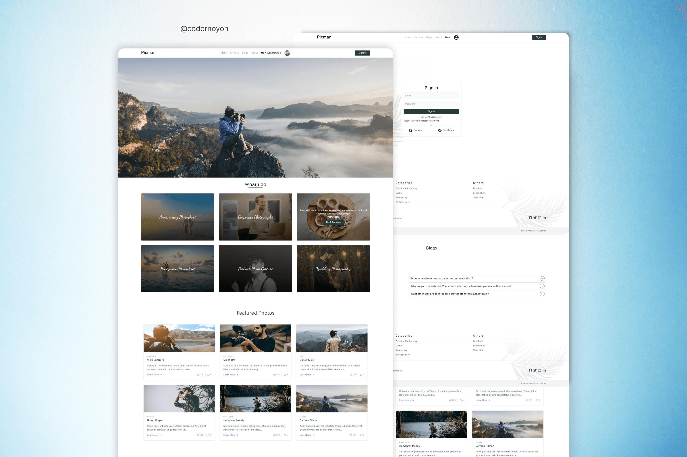

# Picman Photography
 
## Live Website link: https://pic-man.web.app

### Website Features:
---
- Responsive Header Memu
- Hero section / Slider section
- A beautiful footer
- Show real-time form validation
- User can Singup or Signin 
- User can Signin with Google and Facebook `authentication`
- Have a Blog and About page
- Little bit scrolling animation
- `Page not Found 404` added Page
- And also have Loading animation

### To make this project used Technnologies
---
- `React` JS 18
- `React Router` (for routing)
- Most popular css framwork `Tailwindcss` for styling and responsive
- For user `Authentication` are use Firebase and Firebase hooks
- `React-Toastify` to show Toast messages
- `Aos` for scrolling animation
- `React icons` for icons

## Connect with me  

  

  
  

  

## Support Me 

 

            
            

 